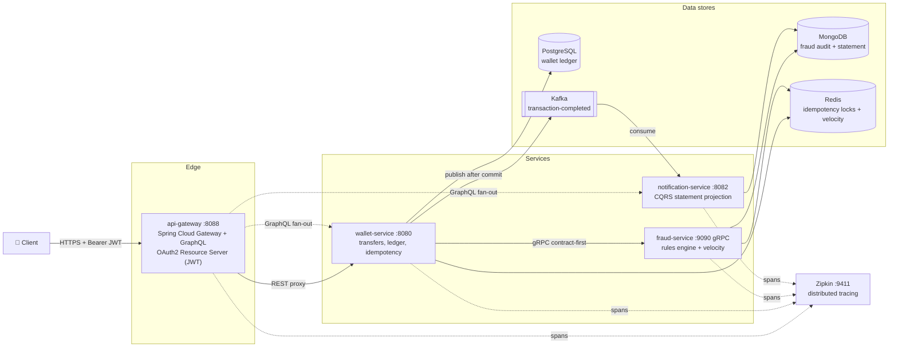
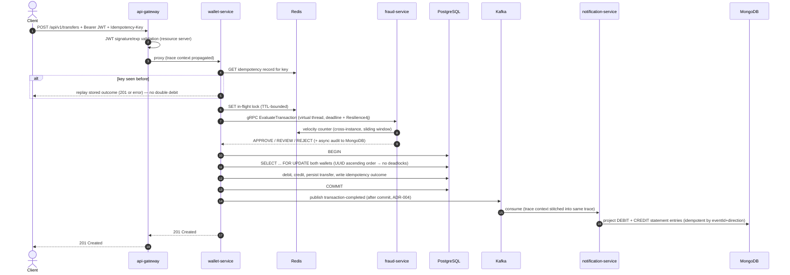
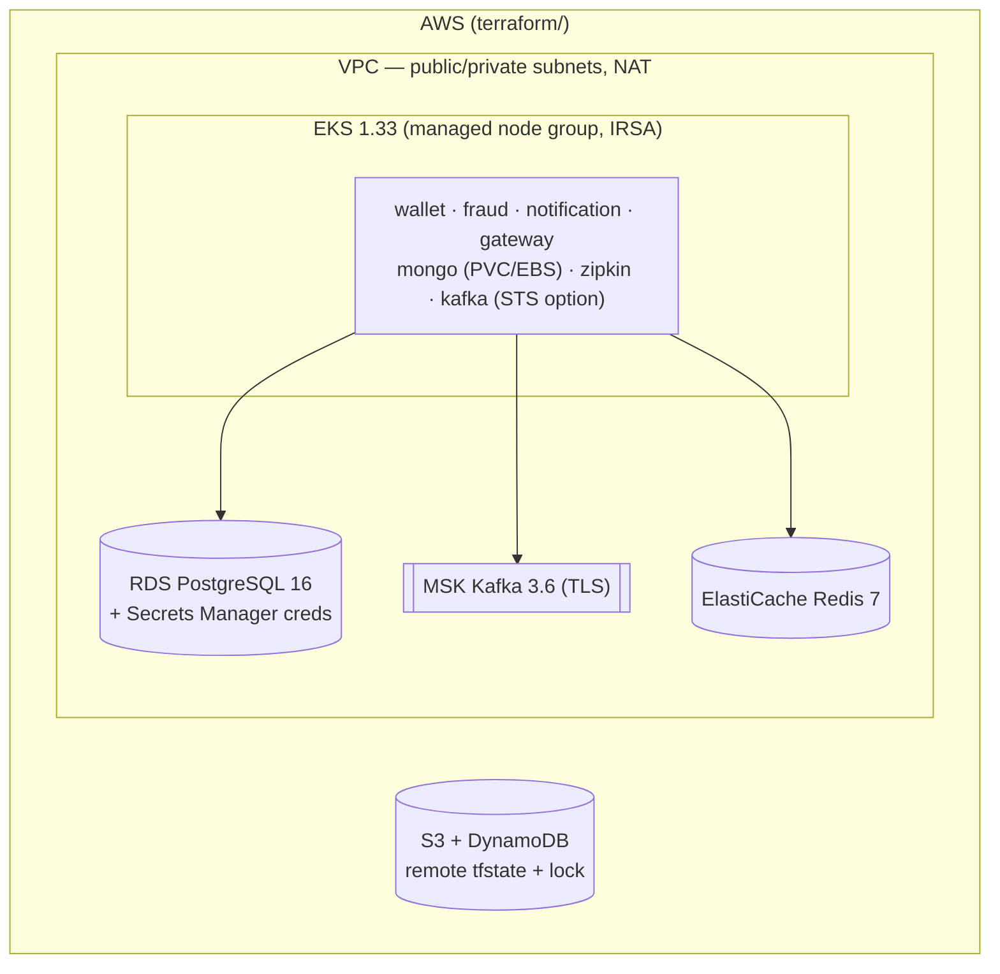

# Nexulor

**Production-grade digital wallet and payment platform — senior backend engineering showcase.**

Nexulor is a distributed financial system built incrementally across four phases: a transactional wallet core, an extracted fraud-detection microservice, an event-driven statement pipeline, and a full cloud-native deployment story (API gateway, OAuth2, distributed tracing, Kubernetes, Terraform). Every architectural decision is recorded in 13 ADRs, every phase is validated end to end, and the whole stack — 65 tests included — runs green on every push via GitHub Actions.

> **Highlights**
> - **4 services, 6 infrastructure pieces, 1 request = 1 trace** across HTTP, gRPC *and* Kafka (verified on Zipkin, including the async leg)
> - **65 tests green** (57 unit + 8 Testcontainers integration tests) in ~1:25, wired into CI
> - **Correctness first**: pessimistic row locking with deadlock-avoiding lock ordering, Redis-coordinated idempotency with exactly-once semantics, fail-closed fraud evaluation
> - **Deploy anywhere**: `docker compose up` for local, Kustomize for Kubernetes (validated on kind), Terraform for AWS (EKS/RDS/MSK/ElastiCache)

---

## 1. The big picture

Four independently deployable services behind a single API gateway:



**Why this shape?** The wallet owns money movement and stays boring: PostgreSQL, ACID, pessimistic locking. Fraud is a different scaling and iteration cadence (rules change faster than ledger code), so it's extracted behind a contract-first gRPC boundary. The statement is a pure read model — it doesn't belong in the transactional path — so it's built asynchronously from Kafka into MongoDB (CQRS). The gateway terminates auth and aggregates reads, so clients never call services directly.

---

## 2. Anatomy of a transfer (the core flow)

Every `POST /api/v1/transfers` walks this path. This is the flow that gets tested, traced, and reasoned about:



**Key correctness properties:**

| Property | Mechanism |
|---|---|
| No lost updates / no overspend | `SELECT … FOR UPDATE` on both wallets inside one transaction |
| No deadlocks under concurrency | Locks acquired in **UUID ascending order** (deterministic global order) |
| No double-spend on retries | Redis idempotency: in-flight lock (409 if concurrent) + replayable outcome record (24h) |
| No silent fraud bypass | Fail-closed: fraud unreachable after retry/breaker ⇒ `503 FRAUD_UNAVAILABLE`, never approve-by-default |
| No ghost statements | Kafka publish **after** commit; consumer projections idempotent by `eventId + direction` |

---

## 3. Architecture decisions (the "why" behind every choice)

Each decision is a numbered ADR in [`docs/ADRs/`](docs/ADRs/). The ones that shape the system most:

| ADR | Decision | Trade-off accepted |
|---|---|---|
| [ADR-001](docs/ADRs/ADR-001-postgresql-pessimistic-locking-for-transfers.md) | **Pessimistic locking** (`FOR UPDATE`) for transfers | Contention cost over optimistic-retry storms; `@Version` kept as secondary net |
| [ADR-002](docs/ADRs/ADR-002-redis-distributed-locks.md) | **Redis** for idempotency locks + replay | Cross-instance coordination without DB write amplification; TTL bounds crash recovery |
| [ADR-003](docs/ADRs/ADR-003-grpc-vs-rest-for-fraud.md) | **gRPC contract-first** for fraud intercom | Codegen + deadlines + streaming-ready vs. plain REST |
| [ADR-004](docs/ADRs/ADR-004-eventual-consistency-with-kafka.md) | **Kafka after-commit** publish; statement is eventually consistent | Read-your-writes lag on statements vs. zero coupling to the transactional path |
| [ADR-005](docs/ADRs/ADR-005-fail-closed-on-fraud-unavailability.md) | **Fail-closed** on fraud unavailability | Reject valid transfers during outage rather than approve unknown risk |
| [ADR-007](docs/ADRs/ADR-007-cross-instance-velocity-redis.md) | **Cross-instance velocity** counters on Redis, fail-open | Fraud window may under-count during Redis outage (deliberate: availability > strictness) |
| [ADR-008](docs/ADRs/ADR-008-testcontainers-integration-tests.md) | **Testcontainers** over in-memory fakes | Slower suite; tests exercise the real Redis/Kafka/Mongo wire protocols |
| [ADR-009](docs/ADRs/ADR-009-api-gateway-graphql-aggregation.md) | **Gateway + GraphQL aggregation** with graceful degradation | Extra hop; one client call instead of N, `partialErrors` when a read model is down |
| [ADR-010](docs/ADRs/ADR-010-oauth2-jwt-resource-server-gateway.md) | **OAuth2 resource server at the edge** | Centralized authN; services stay token-agnostic |
| [ADR-011](docs/ADRs/ADR-011-distributed-tracing-micrometer-brave.md) | **Micrometer Tracing (Brave) + Zipkin**, W3C propagation | Agent-free Boot-native tracing vs. full OTel collector |
| [ADR-012](docs/ADRs/ADR-012-self-hosted-stateful-workloads-on-eks.md) | **Self-hosted Mongo/Zipkin on EKS** vs DocumentDB | Own the ops; ~10x cheaper for the showcase scale |

---

## 4. Distributed tracing — one trace, five services, including the async leg

The tracing stack (Micrometer Tracing + Brave bridge → Zipkin) stitches **HTTP → gRPC → Kafka** into a single trace. The hard parts were the two non-HTTP hops:

- **gRPC on virtual threads** — the fraud call runs on a virtual thread, which does not inherit the trace scope; the parent context is explicitly re-scoped (`currentTraceContext().maybeScope`) inside the worker, or the fraud span forks an orphan trace.
- **Kafka legs** — `spring.kafka.template.observation-enabled` injects `traceparent` headers at produce; the consumer extracts them, so the notification projection joins the same trace that started at the gateway.

Verified end to end (compose **and** on a kind cluster): a single `traceId` covering

```
nexolor-gateway          http post /api/v1/transfers + security filterchain
  └─ nexolor-wallet      http post → gRPC client → transaction-completed.publish → kafka send
       └─ fraud-service  EvaluateTransaction (gRPC server)
       └─ notification-service
            transaction-completed receive → transaction-completed.project
```

- **Zipkin UI:** http://localhost:9411 (compose) or `kubectl -n nexolor port-forward svc/zipkin 9411:9411` (k8s)
- Sampling 100% for the showcase; `ZIPKIN_ENDPOINT` env per service

---

## 5. Testing strategy — 65 tests, real infrastructure

```bash
./mvnw verify                      # everything (requires Docker for *IT)
./mvnw verify -pl wallet-service -am   # one service + its dependencies
```

**Current suite: 65 tests, 0 failures, ~1:25 total** (57 unit + 8 integration). Latest run: `BUILD SUCCESS`.

| Module | Unit | Integration (Testcontainers) | What the ITs prove |
|---|---|---|---|
| wallet-service | 26 | 5 | Idempotency against **real Redis** (in-flight, conflict, replay); `transaction-completed` published to **real Kafka** after commit, with the trace observation active |
| fraud-service | 21 | 2 | Velocity counting against **real Redis** across "instances"; in-process gRPC service tests with generated stubs |
| notification-service | 1 | 1 | Full E2E: consume from **real Kafka**, project statements into **real MongoDB** |
| api-gateway | 9 | — | GraphQL fan-out + partial-failure degradation; security matrix (401 without/invalid JWT, public routes) |

Design principles behind the suite (ADR-008):

- **Fakes lie at the protocol level.** Redis Lua semantics, Kafka consumer rebalancing and Mongo projection races only bite with the real engines — so integration tests spin up real containers via Testcontainers, wired into Maven Failsafe (`*IT` suffix, runs at `verify`).
- **Unit tests own the business rules.** Fraud rules, idempotency state machine, money arithmetic, transfer outcomes — all pure, fast, no Spring context.
- **CI runs the same thing.** GitHub Actions executes the identical `./mvnw verify` on every push/PR (Ubuntu runner + its Docker engine), caching Maven by `pom.xml` hash and uploading surefire/failsafe reports on failure.

---

## 6. Deployment story — three altitudes

### Local: one command

```bash
docker compose up -d --build     # 9 containers, healthchecked, traced
```

### Kubernetes: Kustomize, validated on a real cluster

```bash
kubectl apply -k k8s/overlays/local        # kind / minikube / Docker Desktop
kubectl -n nexolor port-forward svc/api-gateway 8088:8088
```

The manifests under [`k8s/base`](k8s/base/) were **validated end to end on a kind cluster** (k8s 1.33): all 9 pods Ready, JWT-authorized transfers completed, statement projections landing in MongoDB, single traceId in Zipkin. Highlights:

- Kafka runs as a **StatefulSet + headless Service with `publishNotReadyAddresses`** — the KRaft quorum self-registers through pod DNS, avoiding the hairpin-NAT deadlock found (and documented) during validation
- Postgres/Mongo as StatefulSets with PVCs; fraud exposes separate gRPC (9090) and health (8081) Services
- Shared `ConfigMap`/`Secret`; the `jwt-local` profile is injected by the overlay so `base` stays neutral for real OIDC

### AWS: Terraform (EKS / RDS / MSK / ElastiCache)



[`terraform/`](terraform/) mirrors the k8s topology with managed data services: VPC module, EKS with IRSA and the **EBS CSI addon** (backs Mongo's PVC), RDS with credentials in Secrets Manager (never in state-only vars), MSK with TLS, ElastiCache. Remote state via S3 + DynamoDB locking (bootstrap documented in the [Terraform README](terraform/README.md)). Environment knobs (`envs/dev.tfvars`) flip Multi-AZ, retention and instance sizing for prod without code changes.

---

## 7. Tech stack — and why each piece is there

| Technology | Role | Why this and not the obvious alternative |
|---|---|---|
| **Java 21 + virtual threads** | All services | Blocking, simple-to-reason code that scales like reactive; the fraud gRPC call uses a virtual thread with an explicit trace-context rescope |
| **Spring Boot 3.4** | Service runtime | The Java default for a reason; Boot 3.x native observability (Micrometer Observation) |
| **PostgreSQL + Flyway** | Wallet ledger | ACID + row locks are non-negotiable for money; Flyway keeps schema evolution in the repo |
| **MongoDB** | Fraud audit + statement read model | Document shape fits append-only audit and per-wallet statement projections |
| **Redis** | Idempotency + velocity | Sub-ms atomic operations (`SET NX`, counters) that PostgreSQL can't cheaply provide at this access pattern |
| **Apache Kafka (KRaft)** | Domain events | After-commit events decouple the statement from the transaction; KRaft drops ZooKeeper |
| **gRPC + protobuf (contract-first)** | Fraud intercom | `.proto` in `grpc-contracts/` is the single source of truth; deadlines and codegen for free |
| **Resilience4j** | Fault tolerance | Timeout + retry + circuit breaker around fraud; combined with fail-closed semantics (ADR-005) |
| **Spring Cloud Gateway + GraphQL** | Edge | REST proxying plus one-query aggregation with `partialErrors` graceful degradation |
| **Spring Security OAuth2** | AuthN at the edge | Resource-server JWT validation; `jwt-local` (HS256) locally, JWKS/RS256 in prod with zero rule changes |
| **Micrometer Tracing + Zipkin** | Observability | Boot-native tracing with W3C propagation across HTTP/gRPC/Kafka; OTLP migration is a reporter swap |
| **Testcontainers + Failsafe** | Integration tests | Real wire protocols, not fakes (ADR-008) |
| **Kustomize / Terraform** | Deployment | Git-ops-able manifests; reproducible AWS topology with remote state |

---

## 8. API reference

All routes also work through the gateway (`http://localhost:8088/api/v1/...`).

### Wallet service (`:8080`)

| Method | Path | Description |
| ------ | ---- | ----------- |
| `POST` | `/api/v1/wallets` | Open a wallet for an owner |
| `GET`  | `/api/v1/wallets/{walletId}` | Fetch wallet by id |
| `GET`  | `/api/v1/wallets/by-owner/{ownerId}` | Fetch wallet by owner |
| `POST` | `/api/v1/wallets/{walletId}/credits` | Credit funds (demo/funding helper) |
| `POST` | `/api/v1/transfers` | Execute P2P transfer (**`Idempotency-Key` header required**) |
| `GET`  | `/api/v1/transfers/{transferId}` | Fetch transfer |
| `GET`  | `/api/v1/wallets/{walletId}/transfers` | List transfers for a wallet |

### Notification service (`:8082`)

| Method | Path | Description |
| ------ | ---- | ----------- |
| `GET`  | `/api/v1/wallets/{walletId}/statement` | Statement projection (CQRS read model) |

### Transfer outcomes

| Outcome | HTTP |
| ------- | ---- |
| Fraud approves / review | `201 Created` |
| Fraud rejects | `422 FRAUD_REJECTED` |
| Fraud unreachable after retry/breaker | `503 FRAUD_UNAVAILABLE` (fail-closed, ADR-005) |
| Missing `Idempotency-Key` | `400 MISSING_HEADER` |
| Same key in flight elsewhere | `409 IDEMPOTENCY_KEY_IN_FLIGHT` |
| Same key, different payload | `409 IDEMPOTENCY_KEY_CONFLICT` |

Fraud rules: `R3-self-transfer`, `R1-amount-ceiling`, `R2-velocity-source` (cross-instance via Redis). Every evaluation is audited asynchronously to MongoDB.

### GraphQL at the gateway (`:8088`)

`POST /graphql` (GraphiQL at `/graphiql`):

```graphql
query {
  walletSummary(ownerId: "11111111-1111-1111-1111-111111111111") {
    wallet {
      balance
      currency
    }
    recentTransfers {
      amount
      status
    }
    statement {
      direction
      amount
    }
    partialErrors
  }
}
```

`walletSummary` fans out to the wallet core and the statement read model **in parallel** and stitches one response. If the statement service is down the query still returns, with the failure in `partialErrors` — the read model is eventual, the UI shouldn't crash because of it.

### Security matrix (ADR-010)

| Request | Token |
| ------- | ----- |
| `POST /api/v1/wallets`, `POST /api/v1/wallets/*/credits`, `POST /api/v1/transfers` | **required** (`401` without/invalid) |
| GET routes, `POST /graphql` (queries), GraphiQL, actuator | public |

---

## 9. Try it in 5 minutes

```bash
# 1. start everything
docker compose up -d --build

# 2. mint a local demo JWT (HS256, jwt-local profile)
SECRET="local-demo-secret-change-me-0123456789abcdef"
b64url() { openssl base64 -A | tr '+/' '-_' | tr -d '='; }
H=$(printf '{"alg":"HS256","typ":"JWT"}' | b64url)
P=$(printf '{"sub":"demo-user","iss":"local","exp":%s,"iat":%s}' "$(($(date +%s)+3600))" "$(date +%s)" | b64url)
SIG=$(printf '%s.%s' "$H" "$P" | openssl dgst -sha256 -hmac "$SECRET" -binary | b64url)
TOKEN="$H.$P.$SIG"
GW=http://localhost:8088

# 3. open two wallets (auto-seeded on first boot; create returns 409 if they exist)
curl -s -X POST $GW/api/v1/wallets -H "Authorization: Bearer $TOKEN" \
  -H "Content-Type: application/json" \
  -d '{"ownerId":"11111111-1111-1111-1111-111111111111","currency":"BRL"}'
curl -s -X POST $GW/api/v1/wallets -H "Authorization: Bearer $TOKEN" \
  -H "Content-Type: application/json" \
  -d '{"ownerId":"22222222-2222-2222-2222-222222222222","currency":"BRL"}'

# 4. look up their ids
curl -s -X POST $GW/graphql -H "Content-Type: application/json" \
  -d '{"query":"{ walletByOwner(ownerId: \"11111111-1111-1111-1111-111111111111\") { id balance } }"}'
curl -s -X POST $GW/graphql -H "Content-Type: application/json" \
  -d '{"query":"{ walletByOwner(ownerId: \"22222222-2222-2222-2222-222222222222\") { id balance } }"}'

# 5. credit the source wallet (replace SOURCE_ID)
curl -s -X POST $GW/api/v1/wallets/SOURCE_ID/credits -H "Authorization: Bearer $TOKEN" \
  -H "Content-Type: application/json" \
  -d '{"amount":"500.00","currency":"BRL","idempotencyKey":"demo-credit-1"}'

# 6. transfer — fraud-checked over gRPC, locked, idempotent, published, traced
curl -s -X POST $GW/api/v1/transfers -H "Authorization: Bearer $TOKEN" \
  -H "Content-Type: application/json" -H "Idempotency-Key: demo-transfer-1" \
  -d '{"sourceWalletId":"SOURCE_ID","destinationWalletId":"DEST_ID","amount":"25.00","currency":"BRL"}'
# → replay the exact same request: same 201, no double debit (idempotent replay)

# 7. eventually-consistent statement, built from Kafka
curl -s $GW/api/v1/wallets/SOURCE_ID/statement

# 8. watch the whole thing as ONE trace
open http://localhost:9411      # search service: nexolor-gateway
```

---

## 10. Project layout

```
grpc-contracts/        proto files + generated stubs (contract-first fraud/v1)
wallet-service/        financial core: wallets, transfers, idempotency, tracing config
fraud-service/         rules engine, gRPC server, Redis velocity, Mongo audit
notification-service/  Kafka consumer, CQRS statement projection, REST
api-gateway/           REST routing + GraphQL aggregation + OAuth2 resource server
k8s/                   Kustomize base + local overlay (validated on kind)
terraform/             AWS: VPC, EKS, RDS, MSK, ElastiCache (S3+DynamoDB state)
docker-compose.yml     full 9-container local stack
Dockerfile.*           multi-stage builds (cached Maven layers, non-root JRE)
docs/
  PRD.md               product scope + 4-phase roadmap (all phases DONE)
  ADRs/                13 architecture decision records (English)
.github/workflows/     CI: mvnw verify on push/PR with Maven cache
```

---

## 11. CI/CD

GitHub Actions (`.github/workflows/ci.yml`): on every push/PR to `master`, Ubuntu runner + JDK 21 Temurin, Maven cached by `pom.xml` hash, `./mvnw verify` runs the full 65-test suite including Testcontainers integration tests against the runner's Docker engine. Surefire/Failsafe reports are uploaded as artifacts for 7 days on failure.

## 12. Roadmap

All four PRD phases are **complete** (see [docs/PRD.md](docs/PRD.md)). Natural next steps for production hardening:

- Secrets management (External Secrets Operator / Secrets Manager CSI) replacing inline demo values
- HPA + resource tuning on wallet/gateway; tracing sampling policy below 100%
- Real `terraform plan/apply` against a sandbox account; DocumentDB/Atlas migration path if Mongo ops stop being fun
- ADR-013: production secrets strategy
