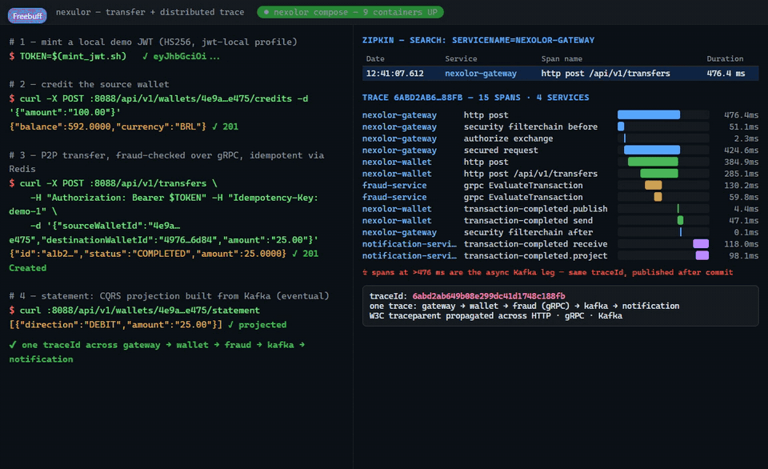
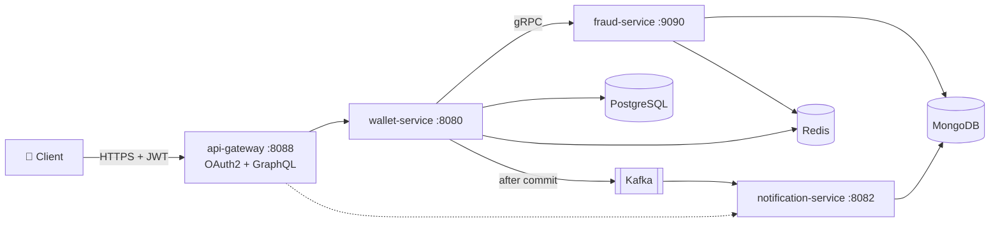

# Nexulor

   

**A digital wallet platform, built the way I'd build it in production.**

Nexulor is a personal project where I designed and built a complete payment platform: a transactional wallet core, a fraud-detection microservice, an event-driven statement pipeline, and an API gateway — deployed locally with Docker, on Kubernetes with Kustomize, and on AWS with Terraform.

Money is a great teacher. Every design decision here had to survive one question: *what happens when two transfers race, a service dies mid-flight, or a request gets retried?* The answers — pessimistic locking, idempotency keys, fail-closed fraud checks — are documented in [13 ADRs](docs/ADRs/), and all 65 tests (57 unit + 8 Testcontainers integration) run on every push via GitHub Actions.

## See it in action

A real transfer, end to end: JWT at the gateway → gRPC call to fraud → locked and committed in PostgreSQL → event published to Kafka → statement projected in MongoDB — all as **a single Zipkin trace**:



## What's inside

Four independently deployable services behind one gateway:

| Service | What it does |
|---|---|
| **wallet-service** `:8080` | The financial core: wallets, P2P transfers, idempotency. PostgreSQL + pessimistic locking, boring on purpose |
| **fraud-service** `:9090` (gRPC) | Rules engine (amount ceiling, self-transfer, velocity) with fail-closed semantics |
| **notification-service** `:8082` | CQRS statement projection, built from Kafka events into MongoDB |
| **api-gateway** `:8088` | REST proxy + GraphQL aggregation + OAuth2 JWT validation at the edge |

Supporting cast: PostgreSQL, MongoDB, Redis, Kafka, Zipkin.



## How a transfer stays correct

Every `POST /api/v1/transfers` walks this path: validate JWT → check idempotency key in Redis → evaluate fraud over gRPC → lock both wallets (`SELECT … FOR UPDATE`, in deterministic UUID order) → debit, credit, commit → publish `transaction-completed` to Kafka → statement projection consumes it into MongoDB.

| What could go wrong | How it's handled |
|---|---|
| Two concurrent transfers overdraw a wallet | Pessimistic row locks, both wallets in one transaction |
| Deadlock under contention | Locks always acquired in UUID ascending order |
| Client retries and double-charges | Redis idempotency: in-flight lock (409) + replayable outcome (24h) |
| Fraud service is down | Fail-closed: `503 FRAUD_UNAVAILABLE` — never approve unknown risk |
| "Ghost" statements after a crash | Event published only after commit; consumer idempotent by `eventId + direction` |

The interesting bits are written down as ADRs: [pessimistic locking](docs/ADRs/ADR-001-postgresql-pessimistic-locking-for-transfers.md), [Redis distributed locks](docs/ADRs/ADR-002-redis-distributed-locks.md), [gRPC for fraud](docs/ADRs/ADR-003-grpc-vs-rest-for-fraud.md), [eventual consistency with Kafka](docs/ADRs/ADR-004-eventual-consistency-with-kafka.md), [fail-closed on fraud](docs/ADRs/ADR-005-fail-closed-on-fraud-unavailability.md), and [nine more](docs/ADRs/).

One tracing detail I'm proud of: the trace survives the two hard hops — the gRPC call runs on a **virtual thread** (which doesn't inherit trace scope, so the context is explicitly re-scoped), and the Kafka leg carries W3C `traceparent` headers, so the statement consumer joins the same trace that started at the gateway. [ADR-011](docs/ADRs/ADR-011-distributed-tracing-micrometer-brave.md) has the details.

## Run it

```bash
docker compose up -d --build     # 9 containers: all services + Postgres, Mongo, Redis, Kafka, Zipkin
open http://localhost:9411       # Zipkin — every request is one trace
```

Then mint a local demo JWT (HS256, `jwt-local` profile) and try a transfer:

```bash
SECRET="local-demo-secret-change-me-0123456789abcdef"
b64url() { openssl base64 -A | tr '+/' '-_' | tr -d '='; }
H=$(printf '{"alg":"HS256","typ":"JWT"}' | b64url)
P=$(printf '{"sub":"demo-user","iss":"local","exp":%s,"iat":%s}' "$(($(date +%s)+3600))" "$(date +%s)" | b64url)
SIG=$(printf '%s.%s' "$H" "$P" | openssl dgst -sha256 -hmac "$SECRET" -binary | b64url)
TOKEN="$H.$P.$SIG"
GW=http://localhost:8088

# two wallets (auto-seeded on first boot; 409 if they already exist)
curl -s -X POST $GW/api/v1/wallets -H "Authorization: Bearer $TOKEN" \
  -H "Content-Type: application/json" \
  -d '{"ownerId":"11111111-1111-1111-1111-111111111111","currency":"BRL"}'
curl -s -X POST $GW/api/v1/wallets -H "Authorization: Bearer $TOKEN" \
  -H "Content-Type: application/json" \
  -d '{"ownerId":"22222222-2222-2222-2222-222222222222","currency":"BRL"}'

# look up their ids
curl -s -X POST $GW/graphql -H "Content-Type: application/json" \
  -d '{"query":"{ walletByOwner(ownerId: \"11111111-1111-1111-1111-111111111111\") { id balance } }"}'
curl -s -X POST $GW/graphql -H "Content-Type: application/json" \
  -d '{"query":"{ walletByOwner(ownerId: \"22222222-2222-2222-2222-222222222222\") { id balance } }"}'

# credit the source wallet (replace SOURCE_ID)
curl -s -X POST $GW/api/v1/wallets/SOURCE_ID/credits -H "Authorization: Bearer $TOKEN" \
  -H "Content-Type: application/json" \
  -d '{"amount":"500.00","currency":"BRL","idempotencyKey":"demo-credit-1"}'

# transfer — fraud-checked over gRPC, locked, idempotent, published, traced
curl -s -X POST $GW/api/v1/transfers -H "Authorization: Bearer $TOKEN" \
  -H "Content-Type: application/json" -H "Idempotency-Key: demo-transfer-1" \
  -d '{"sourceWalletId":"SOURCE_ID","destinationWalletId":"DEST_ID","amount":"25.00","currency":"BRL"}'
# replay the same request: same 201, no double debit

# the eventually-consistent statement, built from Kafka
curl -s $GW/api/v1/wallets/SOURCE_ID/statement
```

To run the test suite: `./mvnw verify` (needs Docker for the integration tests).

## Deployment, three altitudes

| Environment | How | Status |
|---|---|---|
| **Local** | `docker compose up` | 9 healthchecked, traced containers |
| **Kubernetes** | `kubectl apply -k k8s/overlays/local` | Validated end to end on a kind cluster: 9 pods Ready, transfers, projections, traces |
| **AWS** | Terraform in [`terraform/`](terraform/) | EKS + RDS Postgres + MSK + ElastiCache, remote state via S3/DynamoDB, `terraform validate` green |

## API

All routes work through the gateway (`http://localhost:8088/api/v1/...`).

**Wallet service** — `POST /api/v1/wallets` (open wallet) · `GET /api/v1/wallets/{id}` · `GET /api/v1/wallets/by-owner/{ownerId}` · `POST /api/v1/wallets/{id}/credits` · `POST /api/v1/transfers` (requires `Idempotency-Key` header) · `GET /api/v1/transfers/{id}` · `GET /api/v1/wallets/{id}/transfers`

**Notification service** — `GET /api/v1/wallets/{id}/statement`

**GraphQL** — `POST /graphql` (GraphiQL at `/graphiql`): `walletSummary` fans out to the wallet and the statement read model in parallel; if the read model is down the query still returns, with the failure in `partialErrors`.

| Transfer outcome | HTTP |
|---|---|
| Fraud approves / review | `201 Created` |
| Fraud rejects | `422 FRAUD_REJECTED` |
| Fraud unreachable | `503 FRAUD_UNAVAILABLE` (fail-closed) |
| Missing `Idempotency-Key` | `400 MISSING_HEADER` |
| Key in flight / payload conflict | `409 IDEMPOTENCY_KEY_*` |

Writes require a JWT (401 otherwise); reads, GraphQL queries and actuator are public. Locally it's an HS256 demo issuer; in production the gateway swaps to JWKS/RS256 with zero rule changes.

## Tests

65 tests, green in ~1:25: 57 unit tests own the business rules (no Spring context), and 8 integration tests run against **real containers** via Testcontainers — idempotency against real Redis, events against real Kafka, projections against real MongoDB. Fakes lie at the protocol level; that's where the bugs would live. [ADR-008](docs/ADRs/ADR-008-testcontainers-integration-tests.md) explains the trade-off.

Coverage (JaCoCo, aggregate at `./mvnw verify`): notification **98%**, gateway **76%**, fraud **71%**, wallet **49%** — the uncovered remainder is mostly declarative wiring (JPA entities, config classes), not business logic.

## Project layout

```
grpc-contracts/        proto files + generated stubs (contract-first fraud/v1)
wallet-service/        financial core: wallets, transfers, idempotency
fraud-service/         rules engine, gRPC server, Redis velocity, Mongo audit
notification-service/  Kafka consumer, CQRS statement projection, REST
api-gateway/           REST routing + GraphQL aggregation + OAuth2
k8s/                   Kustomize base + local overlay (validated on kind)
terraform/             AWS: VPC, EKS, RDS, MSK, ElastiCache
docs/                  PRD + 13 ADRs
```
